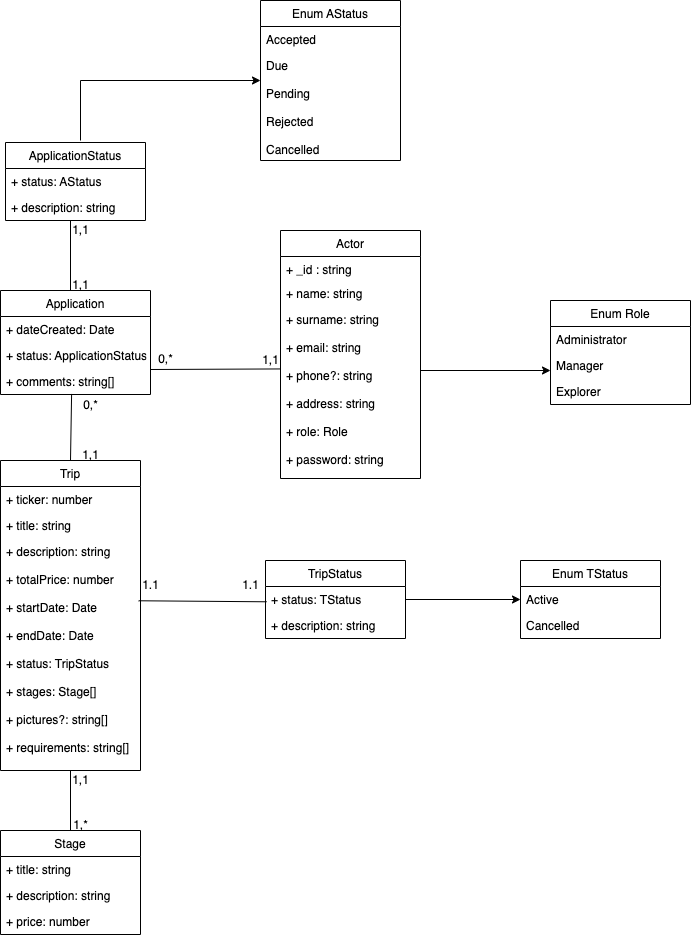

# ACME-EXPLORER

Students: Ole Løkken, Mathias Myrold, Håvard Tysland

## Setup

1. In MongoDB Compass set up a new connection and with authentication where username=`<username>` and password=`<password>`. The URI should be to `mongodb://localhost:27017`. Make sure the username and password defineed in `mongo.Dockefile` is equal to the username and password in the `CONNECTIONSTRING` in `.env`.
2. While in a terminal in the root of the project run the command `docker compose up`. This will set up the connection to the MongoDB database and start the node server. You should have two containers running: `db` and `api`.
3. If you want to run the node server locally, you first need to edit the environment variables in .env. In `CONNECTIONSTRING` change `host.docker.internal` to `localhost`. Still in the root of the project, run the command `npm start` to start the node server, or `npm run dev` to start the server with hot reload using nodemon.

## Auth 
To use endpoints that require a user, or a specific role you need to have a Bearer Token in the AUTHORIZATION header. After you have created an Actor you need to use the Login-route to get an access token. The Actor you create is automatically an Explorer. If you need to get an Actor with a different role you need to adjust this manually in the DB, by for example change the role to "ADMINISTRATOR"

## Documentation with Swagger

All endpoints have been documented can be viewed at `localhost:8080/docs`. After you have recieved a token through the Login-route you can: Copy the token > Press authorize in top of the documentation > Paste token. Now the token will be added to all your requests. 

## Model

