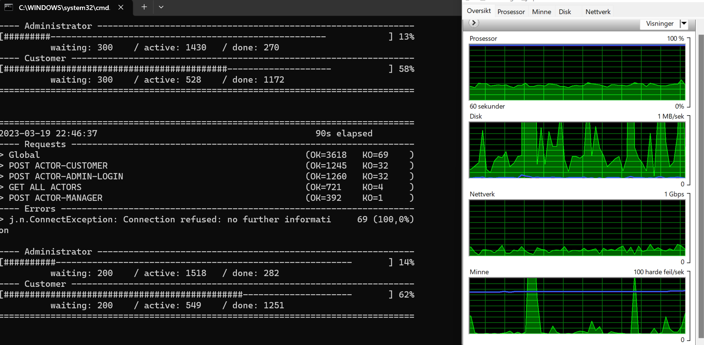
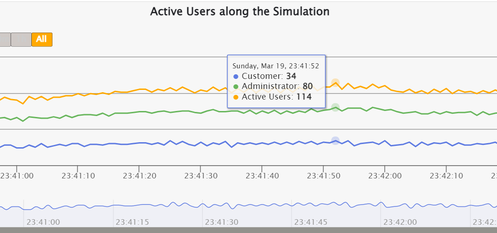
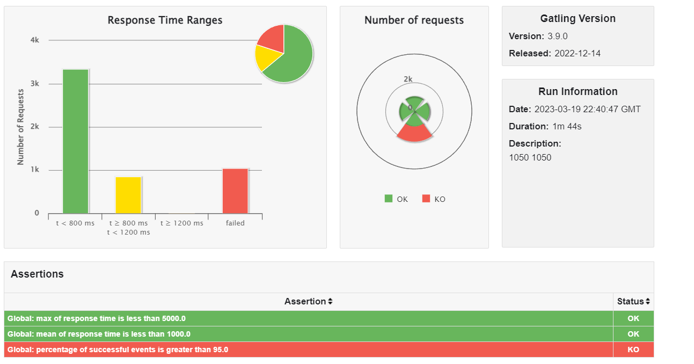
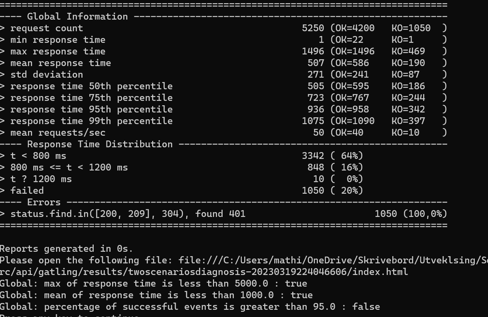

# ACME-EXPLORER

Students: Ole Løkken, Mathias Myrold, Håvard Tysland

## Setup

1. In MongoDB Compass set up a new connection and with authentication where username=`<username>` and password=`<password>`. The URI should be to `mongodb://localhost:27017`. Make sure the username and password defineed in `mongo.Dockefile` is equal to the username and password in the `CONNECTIONSTRING` in `.env`.
2. While in a terminal in the root of the project run the command `docker compose up`. This will set up the connection to the MongoDB database and start the node server. You should have two containers running: `db` and `api`.
3. If you want to run the node server locally, you first need to edit the environment variables in .env. In `CONNECTIONSTRING` change `host.docker.internal` to `localhost`. Still in the root of the project, run the command `npm start` to start the node server, or `npm run dev` to start the server with hot reload using nodemon.

## Auth

To use endpoints that require a user, or a specific role you need to have a Bearer Token in the AUTHORIZATION header. After you have created an Actor you need to use the Login-route to get an access token. The Actor you create is automatically an Explorer. If you need to get an Actor with a different role you need to adjust this manually in the DB, by for example change the role to "ADMINISTRATOR"

## Documentation with Swagger

All endpoints have been documented can be viewed at `localhost:8080/docs`. After you have recieved a token through the Login-route you can: Copy the token > Press authorize in top of the documentation > Paste token. Now the token will be added to all your requests.

## Model

## Performance testing with Gatling

### Setup

While running the api and database either through docker or loccaly, run the script using the command `npm run gatling` for mac/linux and `npm run gatling-win` for windows. As the API does not support directly creating an Administrator, this must be manually done in the database by creating a actor and manually changing the role for that actor to `"ADMINISTRATOR"`. Use this actors email and password in `actor-admin-login.json`.

### Results

In this section the results of the performance tests are presented with relevant screenshots. If wished, the reports are also generated under `src/api/gatling/results`. Select a folder(generated report) and open index.js to view relevant graphics.

### Minimum number of concurrent users that cannot be supported by the scenarios

In our stress test of the API the system had 1958 concurrent users, with 1430 active administrators and 528 active customers/actors

When running this scenraios we had the 2000 injected rampUsers on both administrators and actors during 100 seconds.

### The maximum number of concurrent users that our scenarios supports having a proper performance

To find the maximum number of concurrent users that our scenarios supported having a proper preformance we testet different values of rampUsers during 100 seconds. We ended up with 1050 rampUsers for both administrator and actor. In the gatling report we can see that the number of concurrent/active users peaked on 114.

In the picture under we can see form the galting report that the global response time is less than 5 seconds and the global mean response time is less than 1 second.

The corresponding screen capture of the gatling report:

